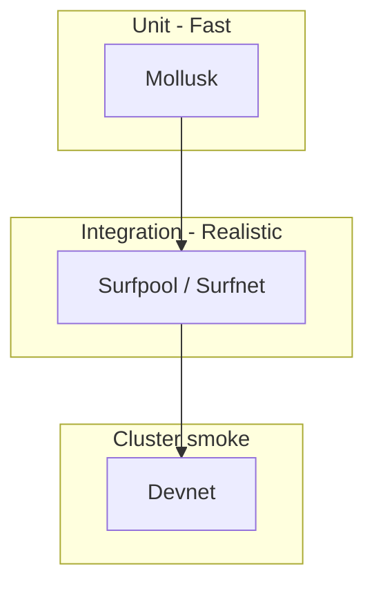

# Local Test Process and Devnet Testing Plan

## Current state

- **Program**: [programs/keyshield/](programs/keyshield/) is a Pinocchio-based, `no_std` Solana program with three instructions: `StoreKey`, `AccessKey`, `ShareKey`. It uses `pinocchio-system` for `CreateAccount`/`Allocate`/`Assign`/`Transfer` and sysvars (`Rent`).
- **Existing tests**: One in-crate test in [programs/keyshield/src/lib.rs](programs/keyshield/src/lib.rs) (instruction discriminators). **No** `tests/` directory; no integration or devnet tests.
- **Dependencies**: [programs/keyshield/Cargo.toml](programs/keyshield/Cargo.toml) already has `mollusk-svm = "0.0.12"` and `solana-sdk = "2.1"` as dev-dependencies.
- **Deploy**: [scripts/deploy.sh](scripts/deploy.sh) supports `devnet` (default) and builds with `cargo build-sbf`. [scripts/verify-vault.sh](scripts/verify-vault.sh) verifies vault on devnet RPC.

---

## 1. Testing pyramid (target)



- **Unit (fast)**: Mollusk — already in dev-deps; run in-process, no validator.
- **Integration (realistic)**: Surfpool — local Surfnet (replacement for solana-test-validator); full RPC, time travel, account manipulation.
- **Cluster smoke**: Devnet — deploy and run a minimal E2E (e.g. store key + verify) or reuse `verify-vault.sh`.

LiteSVM is an alternative for unit tests; the plan keeps **Mollusk** as the primary unit harness to avoid duplicate tooling unless you later add TypeScript/Python tests.

---

## 2. Test layout

Introduce the recommended layout under the **workspace root** (or under `programs/keyshield/` if you prefer all program tests next to the program). Recommendation: **workspace root** so integration and devnet scripts can live in one place.

```
tests/
├── unit/
│   ├── mod.rs
│   ├── store_key.rs
│   ├── access_key.rs
│   └── share_key.rs
├── integration/
│   ├── mod.rs
│   └── full_flow.rs
└── fixtures/
    └── accounts.rs
```

- **`fixtures/accounts.rs`**: Helpers to build account sets for Mollusk: payer (lamports), vault PDA (empty, correct address from seeds), system program, and (for share_key) share PDA and recipient. Use `Pubkey::find_program_address` with seeds `["vault", owner]` and `["share", vault, recipient]` to match program’s `VAULT_SEED` / `SHARE_SEED`.
- **`unit/*.rs`**: Mollusk tests that load the built `.so`, build instructions with the right discriminators and data layout (see instruction handlers below), and call `process_and_validate_instruction` with the fixture accounts and checks (e.g. `Check::success()`, optional `Check::compute_units(...)`).
- **`integration/full_flow.rs`**: Surfpool test: connect to `http://localhost:8899`, deploy or load the program (if Surfnet supports it), then run a full flow: StoreKey → AccessKey (owner) → ShareKey → AccessKey (recipient with proof placeholder). Use `solana_client` and `solana_sdk` (or a small Node/TS script if you prefer the reference’s TypeScript Surfpool style).

**Important**: Rust integration tests that live in the repo need to be part of the workspace or a separate crate so they can depend on `solana-client`, `solana-sdk`, etc. Option A: add a **test-only crate** (e.g. `tests/integration/` as a crate with its own `Cargo.toml`). Option B: use a **shell + Node/TS script** that starts Surfpool and runs a single E2E against localhost; no Rust integration crate. The plan assumes **Option A** for consistency; we can switch to Option B if you prefer scripts only.

---

## 3. Unit tests (Mollusk) — local test process

- **Build requirement**: Mollusk runs the compiled program. Before unit tests, run `cargo build-sbf` (same as [scripts/deploy.sh](scripts/deploy.sh)). So the flow is: `cargo build-sbf && cargo test` (or a single `Makefile`/script that does both).
- **Program ID**: Use a **fixed keypair** for tests (e.g. committed `tests/fixtures/keyshield-keypair.json` or a keypair derived from a seed) so PDAs are deterministic. Alternatively use the keypair at `target/deploy/keyshield-keypair.json` if it exists (document that first build/deploy creates it).
- **Accounts to provide** (from [store_key](programs/keyshield/src/instructions/store_key.rs), [access_key](programs/keyshield/src/instructions/access_key.rs), [share_key](programs/keyshield/src/instructions/share_key.rs)):
                                                                - **StoreKey**: owner (signer, lamports), vault (writable PDA: `["vault", owner, bump]`), system program. Instruction data: 106 bytes (encrypted_key_hash 32, zk_commit 32, mpc_hash 32, timestamp 8, key_type 1, vault_bump 1).
                                                                - **AccessKey**: requester (signer), vault (read-only). Data: non-empty for non-owner (ZK proof placeholder).
                                                                - **ShareKey**: owner (signer), vault, share (writable PDA: `["share", vault, recipient, bump]`), recipient, system program. Data: recipient 32, time_lock 8, share_bump 1 (min 41 bytes).
- **Mollusk setup**: Include **system program** and **Rent sysvar** in the account set (Pinocchio uses `Rent::get()` and `CreateAccount`). Mollusk allows adding sysvars; add Rent and Clock if the program reads them. If Mollusk does not bundle the system program, add it explicitly (lamports/owner = system program ID).
- **Concrete tests**:
                                                                - **store_key.rs**: (1) Success: create vault PDA, then process StoreKey; assert success and (optional) CU check. (2) Double init: process StoreKey twice for same vault; expect `KeyShieldError::VaultAlreadyExists` (custom error 6007). (3) Wrong signer: vault not owned by program, owner not signer → expect error.
                                                                - **access_key.rs**: (1) Owner access: requester == vault owner, no proof → success. (2) Non-owner, empty proof → `InvalidZKProof`. (3) Non-owner, non-empty proof → success (current placeholder accepts any non-empty data).
                                                                - **share_key.rs**: (1) Owner creates share: pre-create vault account with correct data (discriminator + owner, etc.), then process ShareKey with owner signer, share PDA, recipient; assert success. (2) Non-owner cannot share: requester != vault owner → expect error.

**Fixtures**: In `fixtures/accounts.rs`, implement helpers that take `program_id`, `owner`, optional `recipient`, and return (accounts list, vault_pda, vault_bump, share_pda, share_bump) and serialize `Vault` into bytes for pre-initialized vault (for share_key tests). Use `state::Vault` layout from [state.rs](programs/keyshield/src/state.rs) (discriminator, owner, encrypted_key_hash, zk_commit, mpc_hash, created_at, access_flags, reserved).

---

## 4. Integration tests (Surfpool)

- **Tooling**: Install Surfpool CLI (`cargo install surfpool`). Start local Surfnet with `surfpool start` (or `surfpool start --background` in CI).
- **Connection**: Point client to `http://localhost:8899` (Surfnet’s RPC). Use `surfnet_timeTravel`, `surfnet_pauseClock`/`surfnet_resumeClock`, `surfnet_setAccount` if tests need time or account manipulation.
- **Flow**: (1) Ensure program is deployed to Surfnet (deploy `target/deploy/keyshield.so` with program keypair, or use a script that runs `solana program deploy` to localhost). (2) Run full flow: create wallet/keypair, derive vault PDA, send StoreKey tx → confirm; send AccessKey as owner → confirm; send ShareKey to a second wallet → confirm; (optional) send AccessKey as recipient with proof placeholder → confirm. (3) Optionally use `surfnet_setAccount` to set token accounts or other state if you add SPL or other CPIs later.
- **Rust vs TypeScript**: The reference uses TypeScript for Surfpool. For a single repo with a Rust program, either:
                                                                - **Rust**: Add an integration test crate under `tests/integration/` with `solana-client`, `solana-sdk`, build and send transactions, run after `surfpool start`.
                                                                - **Script**: A small Node/TS script (e.g. `scripts/integration-surfpool.mjs`) that uses `@solana/web3.js` and runs the same flow; run via `surfpool start &; node scripts/integration-surfpool.mjs`.

Choose one; the plan assumes **Rust integration test** for consistency with unit tests.

---

## 5. Devnet smoke tests

- **Goal**: Ensure the program works on real devnet (RPC, cluster state).
- **Option A — Script**: Reuse existing scripts. Run `./scripts/deploy.sh devnet`, then run `./scripts/verify-vault.sh <wallet>` after performing one StoreKey from the frontend or a small E2E script. No new code; document in README or CI.
- **Option B — Automated smoke**: Add a script or CI job that: (1) `solana config set --url devnet`, (2) `cargo build-sbf && solana program deploy ...`, (3) run a minimal E2E (e.g. one StoreKey + one getAccountInfo to verify vault account size and discriminator). Same can be implemented in Rust (integration test that uses devnet RPC URL) or in Node/TS.
- **Recommendation**: Start with **Option A** (manual or CI that runs deploy + verify-vault); add Option B if you want a fully automated devnet gate.

---

## 6. CI (e.g. GitHub Actions)

- **Unit tests**: Job that runs `cargo build-sbf` then `cargo test` (or `cargo test --no-run` then run only unit tests). Fast gate; no Surfpool or devnet.
- **Integration tests**: Job depends on unit tests; starts Surfnet with `surfpool start --background` (or equivalent); runs integration tests (e.g. `cargo test --test integration_*` or a separate test binary that connects to localhost:8899). Ensure `surfpool` is installed (e.g. `cargo install surfpool` in CI or use a pre-built binary).
- **Devnet smoke** (optional): Separate job or manual workflow: deploy to devnet, then run verify script or minimal E2E. Use secrets for deploy keypair; consider rate limits and flakiness.

Example structure:

```yaml
# Conceptual
jobs:
  unit-tests:
    runs-on: ubuntu-latest
    steps:
   - uses: actions/checkout@v4
   - name: Build program
        run: cargo build-sbf
   - name: Run unit tests
        run: cargo test

  integration-tests:
    runs-on: ubuntu-latest
    needs: unit-tests
    steps:
   - uses: actions/checkout@v4
   - name: Install Surfpool
        run: cargo install surfpool
   - name: Start Surfpool
        run: surfpool start --background
   - name: Build and run integration tests
        run: cargo test --test integration_*
```

(Exact test target names depend on how you name the integration test binary/crate.)

---

## 7. File and dependency changes (summary)

| Item | Action |

|------|--------|

| [programs/keyshield/Cargo.toml](programs/keyshield/Cargo.toml) | Keep `mollusk-svm` and `solana-sdk`; add `solana-program` if needed for PDA helpers in tests. |

| Root or program `Cargo.toml` | If integration tests are in-tree, add a `[[test]] `or a separate crate with `solana-client`, `solana-sdk`. |

| `tests/unit/mod.rs` | Re-export or glue for unit tests. |

| `tests/unit/store_key.rs` | Mollusk tests for StoreKey (success, double init, auth). |

| `tests/unit/access_key.rs` | Mollusk tests for AccessKey (owner, non-owner no proof, non-owner with proof). |

| `tests/unit/share_key.rs` | Mollusk tests for ShareKey (owner share, non-owner reject). |

| `tests/fixtures/accounts.rs` | PDA derivation, account vec builders, Vault serialization for tests. |

| `tests/integration/full_flow.rs` | Surfpool E2E (StoreKey → Access → Share → Access). |

| `scripts/deploy.sh` | No change; already devnet-capable. |

| `scripts/verify-vault.sh` | No change; use for devnet verification. |

| New: `.github/workflows/test.yml` (or similar) | Unit → integration → optional devnet smoke. |

---

## 8. Best practices (from your reference)

- Use **deterministic PDAs** and a **fixed program keypair** (or seeded keypair) in unit tests for reproducibility.
- **Minimize fixtures**: Prefer building accounts in code (fixtures module) over large pre-serialized blobs.
- **Profile CU** in Mollusk (e.g. `Check::compute_units(max)`) to catch regressions.
- Keep **unit tests as the default CI gate**; run integration and devnet in separate steps so feedback stays fast.

---

## 9. Pinocchio / no_std note

The program uses **Pinocchio** and `#![no_std]`. Unit tests run in the **host** (test) binary, which links against the **built `.so`**; the on-chain code remains no_std. Test code itself can use std (e.g. `solana_sdk::pubkey::Pubkey::find_program_address`). No change to the program crate type or features required for Mollusk.

---

## 10. Order of implementation

1. Add **test layout**: `tests/unit/mod.rs`, `tests/unit/store_key.rs`, `tests/fixtures/accounts.rs`, and wire them so `cargo test` runs (e.g. move or duplicate integration-style tests into a `[[test]]` that loads the .so).  

                                                                                                - Note: In Rust, **integration tests** live in `tests/*.rs` at the crate root; they are compiled as a separate binary. So `programs/keyshield` would have `programs/keyshield/tests/store_key.rs` etc., and each would use Mollusk loading `target/deploy/keyshield.so`. The **program_id** for tests should come from `target/deploy/keyshield-keypair.json` or a fixture. So the layout could be **under the program**: `programs/keyshield/tests/unit/...` and `programs/keyshield/tests/fixtures/...`, and integration under repo root or under program. Clarification: Standard Rust is `programs/keyshield/tests/*.rs` for integration tests for that crate. So we put unit tests (Mollusk) in `programs/keyshield/tests/` (e.g. `programs/keyshield/tests/store_key.rs`, `access_key.rs`, `share_key.rs`, `fixtures.rs` or `common/mod.rs`).

2. Implement **fixtures**: PDA derivation, system program, Rent, account vecs for StoreKey / AccessKey / ShareKey.
3. Implement **StoreKey** Mollusk tests (success, vault already exists, bad signer).
4. Implement **AccessKey** and **ShareKey** Mollusk tests.
5. Add **Surfpool** integration: install Surfpool, script or crate to start Surfnet and run one full-flow test.
6. Add **CI**: unit job (build-sbf + test), then integration job (Surfpool start + integration test).
7. Document **devnet**: run deploy + verify-vault; optionally add automated devnet smoke job.

This keeps the local test process (Mollusk) and devnet usage clearly separated and matches the referenced testing strategy (LiteSVM/Mollusk for unit, Surfpool for integration, cluster for smoke).