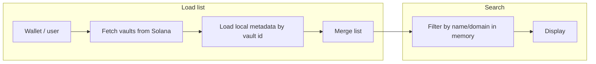

# Fix Search “No Database” With Onchain-Connected Hybrid List

## Current state

- **Search**: Implemented in [frontend /hooks/useVaults.ts](frontend /hooks/useVaults.ts). It filters in-memory over `vaultItems` by `name` and `domain` (lines 62–72).
- **Data source**: `vaultItems` is loaded only from `chrome.storage.local` or `localStorage` (keyed by Clerk `userId`). There is no Solana RPC call and no link to onchain vault accounts.
- **Onchain**: The Solana program ([programs/keyshield/](programs/keyshield/)) has one **Vault** account per owner (PDA seeds: `["vault", owner]`). The extension ([extension/src/lib/vault-client.ts](extension/src/lib/vault-client.ts)) can read/write that vault and stores metadata (domain, keyName) in IndexedDB ([extension/src/storage/secure-storage.ts](extension/src/storage/secure-storage.ts)).

So today: **no database** in the sense of a defined, dynamic source — just local key-value storage. The list is not “connected and managed onchain.”

## Easiest approach: hybrid list (onchain + local metadata)

Keep the list **not fully onchain**: onchain answers “what exists,” local storage holds **searchable** fields (name, domain, type). Search stays in-memory over the merged list. No new backend or indexing service.



- **Onchain**: Source of truth for “which vault(s) exist” (fetch vault account(s) for the connected wallet).
- **Local**: One “metadata” store (localStorage or IndexedDB) keyed by vault id (e.g. vault PDA pubkey or owner), holding `{ name, domain, type, ... }` for display and search.
- **Search**: Unchanged logic in `useVaults`: filter the merged list by `searchQuery` (name/domain) and `activeFilter` in a `useMemo`.

This satisfies “database is dynamic and connected/managed onchain” (list is driven by onchain vaults) and “the list won’t be necessary all onchain” (names/domains stay offchain).

## Review summary (strengths / risks)

- **Strengths**: Hybrid keeps search fast/in-memory (no RPC lag for filters). Onchain as source of truth prevents local drift/race conditions. No new backend keeps cost and privacy risk low. Names/domains stay offchain as intended.
- **Risks**: Single vault per owner limits scalability (program upgrade needed for multiple PDAs per owner). Local metadata can desync if user clears storage or switches devices (mitigate with onchain metadata hash for verification). Wallet dependency requires handling "Clerk + Solana" auth (e.g. sign message to link). For 100+ items, add pagination or debounce.
- **Effort**: ~4–6 hours with Solana web3.js and extension-style PDA derivation. MVP in 1–2 days; production: add sync checks and multi-vault support.

## Action plan (step-by-step, with code)

Assume Solana web3.js for RPC and the extension's deriveVaultPDA logic. Target file: [frontend /hooks/useVaults.ts](frontend /hooks/useVaults.ts).

### 1. Wire wallet into the list

- Install adapter if needed: `npm i @solana/wallet-adapter-react @solana/web3.js`
- In `useVaults.ts` (or a `useWallet.ts`), get the connected wallet and pass it into the data flow.
```ts
// frontend/hooks/useVaults.ts
import { useWallet } from '@solana/wallet-adapter-react';
import { PublicKey, Connection } from '@solana/web3.js';

const RPC = "https://api.devnet.solana.com";  // Or Helius RPC
const PROGRAM_ID = new PublicKey("YOUR_PROGRAM_ID_HERE");

export function useVaults(searchQuery: string, activeFilter: string, userId: string | undefined) {
  const { publicKey } = useWallet();
  const [vaultItems, setVaultItems] = useState<VaultItem[]>([]);
  const connection = useMemo(() => new Connection(RPC), []);

  useEffect(() => {
    if (publicKey) {
      fetchAndMergeVaults(publicKey);
    } else {
      loadLocalOnly();  // Fallback to Clerk/local if no wallet
    }
  }, [publicKey]);

  // ... existing state and filteredItems logic
}
```


### 2. Fetch vault(s) from chain

- Derive PDA with same seeds as extension; use `getAccountInfo`. Single vault for now; later use `getProgramAccounts` for multi.
```ts
async function fetchAndMergeVaults(connection: Connection, owner: PublicKey) {
  const [vaultPDA] = PublicKey.findProgramAddressSync(
    [Buffer.from("vault"), owner.toBuffer()],
    PROGRAM_ID
  );

  const account = await connection.getAccountInfo(vaultPDA);
  if (account) {
    const metadata = await loadLocalMetadata(vaultPDA.toString());
    const mergedItem = { ...metadata, onchain: true, id: vaultPDA.toString(), pda: vaultPDA.toString() };
    setVaultItems([mergedItem]);
  } else {
    setVaultItems([]);
  }
}
```


3. **Local metadata store keyed by vault id**  

Introduce a single place for “list metadata” keyed by vault id (e.g. `vault_metadata_<vaultPdaOrOwner>`):

   - **Option A (easiest)**: Keep using `chrome.storage.local` / `localStorage` but change the shape: one key per vault id, value = `{ name, domain, type, ... }`. No schema change to the program.
   - **Option B**: Reuse the extension’s IndexedDB (only if the frontend runs inside the same extension): message the extension to get/set vault metadata so the list is shared with the extension.

Start with **Option A** so the frontend works standalone: e.g. key `keyshield_meta_<walletAddress>` or `keyshield_meta_<vaultPda>` with value = array or map of metadata entries if you later support multiple vaults per wallet.

4. **Merge on load**  

In `useVaults` (or the data layer it uses):

   - Fetch onchain vault(s) for the connected wallet (step 2).
   - For each vault, read metadata from the local store by vault id (step 3).
   - Build a single list: each row = onchain vault + local metadata (name, domain, type, etc.). Use vault PDA (or owner) as stable `id` for React keys and for persisting metadata.
   - Set that merged list as the source for the existing search/filter.

5. **Keep search as-is**  

No change to the search logic: continue filtering the merged list in-memory by `searchQuery` and `activeFilter` in [frontend /hooks/useVaults.ts](frontend /hooks/useVaults.ts) (lines 62–72). The only change is that the list is now backed by “onchain vaults + local metadata” instead of “localStorage only.”

6. **Add/update/delete**  

   - **Add**: Call program (e.g. store_key) if you want the new key onchain; then write metadata to the local store and append to the merged list (or refetch vaults and merge again).  
   - **Update**: Update local metadata only (name, domain, etc.); no program change needed unless you add onchain fields later.  
   - **Delete**: If you support “remove from list,” either mark as hidden in local metadata or close the vault onchain (if the program supports it) and remove local metadata.

## Important detail: one vault per owner

The current program has a single Vault PDA per owner (`seeds: ["vault", owner]`). So today you get **at most one onchain vault per wallet**. The extension also uses `vaultId: owner.toString()` in metadata, so one metadata row per owner there. So the “easiest” path is: list = that one onchain vault + one local metadata object; search runs on that one row (and any extra local-only rows if you allow “draft” or local-only entries). If you need **multiple keys per wallet** in the list, you’ll need a program change (e.g. multiple vault accounts per owner with an index in the PDA seeds) and then a small “metadata per vault id” store; the same hybrid pattern (onchain list + local metadata, search in-memory) still applies.

## Summary

- **Easiest fix**: Hybrid list — onchain vault(s) as source of truth, local storage for searchable metadata (name, domain, type). Merge on load; keep search in-memory over the merged list in `useVaults`.
- **No new backend or DB**: Use existing Solana RPC + same localStorage/chrome.storage (or extension IndexedDB if in-extension).
- **Minimal code**: Add wallet usage, one “fetch vault(s)” call, a small metadata-by–vault-id layer, and merge logic; leave search and filter logic unchanged.