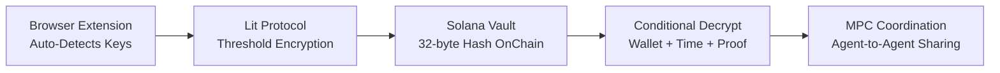
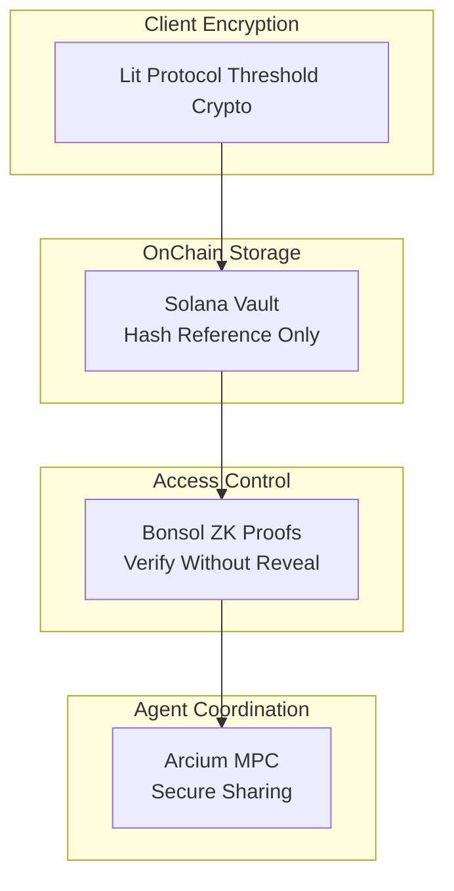

# KeyShield — Executive Pitch Deck

**Decentralized API Key Vault on Solana**

---

## Slide 1: The Problem

API keys are credentials for **high-value services** (OpenAI, AWS, Helius). Unlike passwords (login-only), API keys:

- **Control spending/access** — can drain wallets, leak data, incur unbounded costs
- **Stored in plaintext** — .env files, clipboards, code snippets, screenshots
- **Hard to detect and manage** — across teams, agents, and environments
- **No conditional access** — no time-locks, approval flows, or audit trails

**Result**: $4.5B+ lost to API key leaks annually. Developers and teams have no decentralized, agent-native solution.

---

## Slide 2: The Solution

**KeyShield** = Decentralized API key vault with privacy-first architecture.

- **Auto-detection** — 10+ providers (Helius, GitHub, OpenAI, bloXroute, Google Gemini)
- **Threshold encryption** — Lit Protocol: decrypt only when conditions are met
- **MPC sharing** — Arcium: agent coordination without full key reveal
- **On-chain access control** — Solana: immutable permissions and audit trail

**One sentence**: KeyShield auto-detects API keys, encrypts them with Lit Protocol, stores a hash on Solana, and enables conditional decryption and MPC-based agent coordination.

---

## Slide 3: How It Works

1. **Detect** — Extension scans forms, clipboard, and (future) HTTP headers and OCR.
2. **Encrypt** — Lit Protocol encrypts the key with wallet/time conditions.
3. **Store** — Only a 32-byte hash goes on-chain; full ciphertext stays off-chain (IndexedDB).
4. **Access** — Decrypt only when wallet matches and conditions are satisfied.
5. **Share** — Arcium MPC lets agents use the key without ever holding plaintext.

---

## Slide 4: Differentiation vs Existing Solutions

| vs | Their focus | KeyShield |
|----|-------------|-----------|
| **Bitwarden / 1Password** | Passwords, form-based, local vault | API keys, headers + clipboard + agents, on-chain permissions + MPC |
| **.env files** | Plaintext, no access control, no detection | Encrypt before storage, conditional decrypt, auto-detect leaks |
| **Vault / Secrets Manager** | Centralized, single tenant | Decentralized, on-chain audit trail, wallet-native |

**KeyShield is the only solution** that is decentralized, auto-detecting, and agent-native with threshold crypto and MPC.

---

## Slide 5: Key Innovation — API vs Password

| | Passwords | API Keys |
|--|-----------|----------|
| **Use** | Static, form-based, one-time per session | Dynamic, header-based, reusable in agents |
| **Detection** | Bitwarden-style DOM scanning works | Need broader: clipboard, OCR, HTTP intercept |
| **Risk** | Wrong fill → failed login | Wrong fill → key exposure, spend, data leak |
| **Sharing** | Copy password | Need MPC so agents never see full key |

**KeyShield approach**: Multi-source detection + threshold encryption + agent MPC bridges.

---

## Slide 6: Architecture — Privacy Layers

- **Layer 1** — Client-side: Lit encrypts before any key leaves the browser.
- **Layer 2** — On-chain: Only 32-byte hash; full ciphertext in IndexedDB.
- **Layer 3** — Access: ZK proofs (Bonsol) verify access without revealing secrets.
- **Layer 4** — Sharing: Arcium MPC for agent-to-agent coordination.

---

## Slide 7: Product Roadmap

| Quarter | Focus |
|---------|--------|
| **Q1 2026 (Now)** | Core vault, auto-detection, Lit encryption |
| **Q2 2026** | MPC agent coordination, API routing proxy, multi-browser |
| **Q3 2026** | Jupyter testing, OCR detection, audit report generator |
| **Q4 2026** | Multi-sig vaults, cross-chain bridges, AI agent integrations |

---

## Slide 8: Market Opportunity

- **TAM** — 26M+ developers (Stack Overflow 2024); 70%+ use API keys (OpenAI, AWS, GitHub).
- **Pain** — $4.5B+ lost to API key leaks annually (CyberNews 2023).
- **Adoption** — Web3 developers (Solana ecosystem) first, then Web2 bridge.

---

## Slide 9: Traction & Validation

- Solana devnet deployment working
- Extension auto-detects 10+ providers
- Lit Protocol v4 integration complete
- Testing with Mollusk + Surfpool in place
- Hackathon / grant applications in progress

---

## Slide 10: Ask & Next Steps

- **Seeking**: Funding / hackathon prize / partnership
- **Use of funds**: Mainnet audit, Arcium MPC integration, developer outreach
- **Contact**: [Your contact info]

---

*KeyShield — Decentralized API key management with privacy-preserving encryption.*
