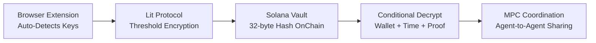
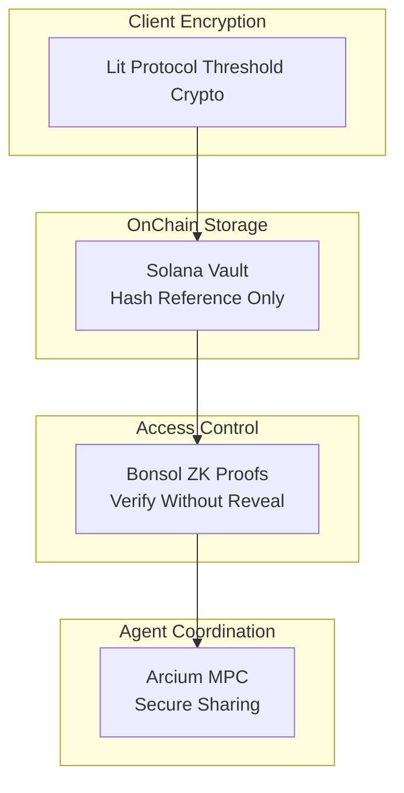
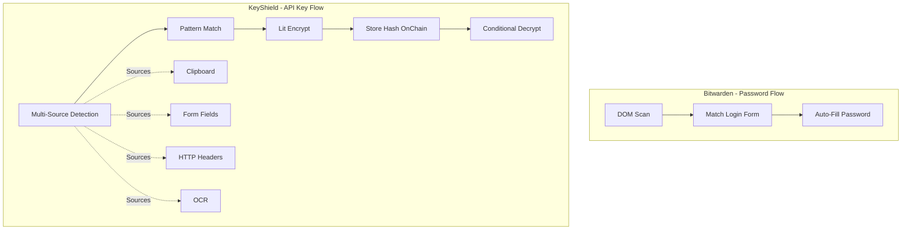
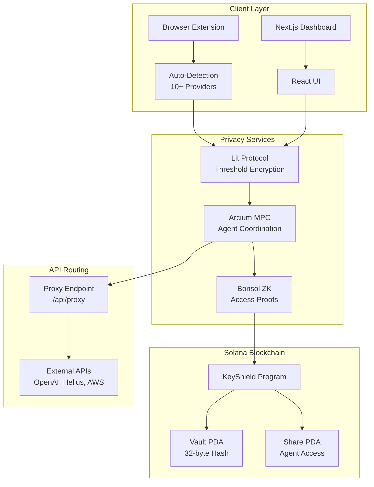
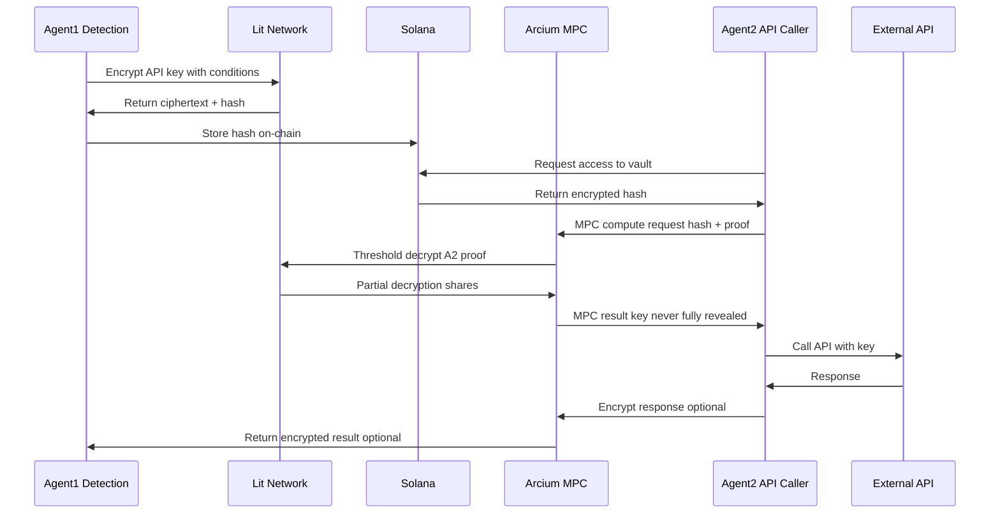

# KeyShield Diagrams (Mermaid)

All diagrams for slides and documentation. Render with Mermaid (e.g. GitHub, VS Code, or mermaid-cli).

---

## 1. How It Works (Pitch Slide 3)



---

## 2. Architecture — Privacy Layers (Pitch Slide 6)



---

## 3. Detection Flow vs Password Managers



---

## 4. Full Architecture with All Components



---

## 5. MPC Agent Coordination (Sequence)



---

## 6. API Routing Bridge

```mermaid
flowchart LR
  Agent[AI Agent] -->|Encrypted Intent| Proxy[/api/proxy]
  Proxy -->|Decrypt with Lit| Lit[Lit Protocol]
  Lit -->|API Key| Proxy
  Proxy -->|Real Call| API[OpenAI / Helius]
  API -->|Response| Proxy
  Proxy -->|Encrypt Response| Agent
```

---

## Export to PNG/SVG (mermaid-cli)

```bash
# Install
npm i -g @mermaid-js/mermaid-cli

# Export (from repo root)
mmdc -i docs/pitch/assets/DIAGRAMS.md -o docs/pitch/assets/diagrams_output
# Or export each diagram separately; mmdc accepts single .mmd files with one graph each.
```

For PDF export of the full pitch deck with embedded diagrams, use Marp, md-to-pdf, or a Markdown-to-PDF tool that supports Mermaid (e.g. Pandoc + mermaid-filter).
