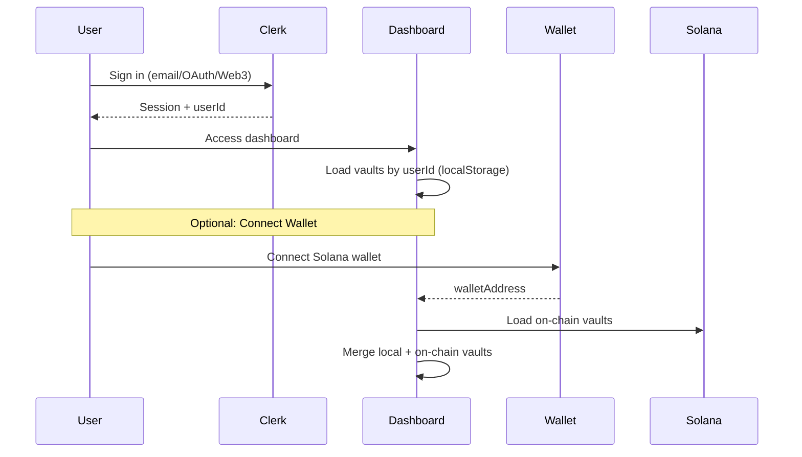

# KeyShield Product Roadmap

**Last Updated**: February 1, 2026  
**Status**: Phase 1 Complete ✅ - Full encryption system operational

**Feature timeline and implementation priorities**

Audience: Team, stakeholders, investors.

---

## Phase 1: Core Infrastructure (Q1 2026) — Complete ✅

- [x] Solana program (StoreKey, AccessKey, ShareKey)
- [x] Browser extension auto-detection (10+ providers)
- [x] Lit Protocol v4 encryption (hash on-chain, ciphertext off-chain)
- [x] Hybrid on-chain + local metadata vault list
- [x] Testing framework (Mollusk unit, Surfpool integration)
- [x] **Frontend store flow with wallet signing (Feb 2026)**
- [x] **Complete encryption-to-chain pipeline (Feb 2026)**
- [x] **IndexedDB ciphertext storage (Feb 2026)**
- [x] **Transaction builder with proper instruction format (Feb 2026)**
- [x] **Clerk authentication with userId-based vaults (Feb 2026)**
- [x] **Dual storage: Clerk userId (local) + Wallet (on-chain) (Feb 2026)**

---

## Phase 2: Advanced Privacy & Coordination (Q2 2026)

**Focus**: MPC, conditional access, multi-browser support

| Feature | Description | Effort | Status |
|---------|-------------|--------|--------|
| **Clerk Wallet Linking** | Map multiple Solana wallets to Clerk user profile | 1 week | In Progress |
| **Lit Conditional Decrypt** | Time-lock, NFT-gated access | 2–3 weeks | Planned |
| **Arcium MPC Integration** | Agent coordination, secure sharing | 3–4 weeks | Planned |
| **API Routing Proxy** | `/api/proxy` endpoint for confidential calls | 1–2 weeks | Planned |
| **Multi-Browser Support** | Firefox, Safari extension builds | 1 week | Planned |
| **Enhanced Detection** | OCR, HTTP intercept, .env file scanning | 2–3 weeks | Planned |

---

## Phase 3: Developer Tools & Testing (Q3 2026)

**Focus**: Usability, testing, audit

| Feature | Description | Effort | Status |
|---------|-------------|--------|--------|
| **Jupyter Testing Framework** | Interactive notebooks for encryption/MPC flows | 1 week | Planned |
| **Vault Audit Report Generator** | Export vault access logs, detection history | 2 weeks | Planned |
| **CLI Tool** | `keyshield encrypt/decrypt/share` command-line interface | 1–2 weeks | Planned |
| **SDK for Agents** | Python/JS SDK for AI agents (Langchain, AutoGen) | 3–4 weeks | Planned |
| **Security Audit** | Third-party audit of Solana program + Lit integration | 4–6 weeks | Planned |

---

## Phase 4: Ecosystem & Scale (Q4 2026)

**Focus**: Cross-chain, AI agents, enterprise

| Feature | Description | Effort | Status |
|---------|-------------|--------|--------|
| **Multi-Sig Vaults** | Team vaults with M-of-N approval | 3–4 weeks | Planned |
| **Cross-Chain Bridges** | Ethereum, Polygon key storage | 4–6 weeks | Planned |
| **AI Agent Integrations** | Pre-built connectors for Langchain, AutoGen, AgentC | 2–3 weeks | Planned |
| **Enterprise Dashboard** | Team management, usage analytics | 4–6 weeks | Planned |
| **Mainnet Launch** | Production deployment after audit | 2–3 weeks | Planned |

---

## Timeline Overview

| Quarter | Theme | Key Deliverables |
|---------|--------|------------------|
| **Q1 2026** | Core vault + auth + Lit encryption | Program, extension, Lit v4, Clerk auth, hybrid storage |
| **Q2 2026** | MPC + routing + multi-browser | Wallet linking, conditional decrypt, Arcium MPC, API proxy |
| **Q3 2026** | Developer tools + audit | Jupyter, audit report, CLI, agent SDK, security audit |
| **Q4 2026** | Ecosystem + scale | Multi-sig, cross-chain, AI integrations, enterprise, mainnet |

---

## Implementation Priority Order

1. **Clerk wallet linking UI** — Allow users to link/manage multiple Solana wallets
2. **Lit conditional decryption** — Time-lock and wallet conditions (unblocks MPC and proxy)
3. **API routing proxy** — Enables confidential agent-to-API calls (can use Lit only first)
4. **Arcium MPC integration** — Agent coordination without full key reveal
5. **Multi-browser extension** — Firefox/Safari builds
6. **Jupyter testing** — Interactive flows for encryption/MPC
7. **Vault audit report** — Export logs and detection history
8. **CLI and agent SDK** — Developer adoption
9. **Security audit** — Before mainnet
10. **Mainnet launch** — After audit and hardening

---

## Clerk + Solana Integration Details

### Authentication Flow

### Storage Decision Matrix

| User State | Storage Location | Encryption | Key Format |
|------------|-----------------|------------|------------|
| **Clerk only** | localStorage (`keyshield_vaults_${userId}`) | Local AES (fallback) | Full key stored |
| **Clerk + Wallet** | Solana PDA + IndexedDB | Lit Protocol threshold | 32-byte hash on-chain |
| **Multi-wallet** | Multiple PDAs per userId | Lit Protocol per wallet | Hash per vault |

---

## Related Documents

- [IMPLEMENTATION_PLAN.md](IMPLEMENTATION_PLAN.md) — Technical priorities and sequencing.
- [DECISION_LOG.md](DECISION_LOG.md) — Architecture decisions.
- [../pitch/PITCH_DECK.md](../pitch/PITCH_DECK.md) — Slide 7: Product roadmap summary.
- [../../ARCHITECTURE.md](../../ARCHITECTURE.md) — Full technical architecture with Clerk integration.
