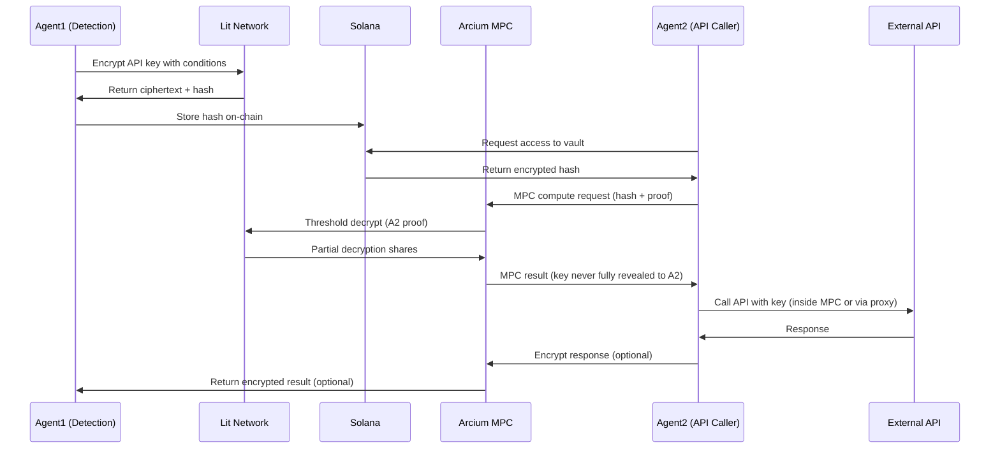

# MPC Coordination Guide

**Arcium MPC for Agent-to-Agent Key Sharing**

This guide explains how KeyShield uses Arcium MPC for multi-agent coordination: Agent1 detects a key; Agent2 uses it for an API call without ever holding plaintext.

---

## 1. Use Case

- **Agent1**: Detects API key (e.g. in clipboard or form), encrypts with Lit, stores hash on-chain.
- **Agent2**: Needs to call an external API (e.g. OpenAI, Helius) using that key.
- **Requirement**: Agent2 must not see the raw API key; decryption and use happen inside MPC.

---

## 2. Flow Overview



---

## 3. Why MPC for Agents

| Benefit | Description |
|--------|-------------|
| **No full reveal** | Agent2 never sees plaintext; only encrypted result or MPC output. |
| **Coordination** | Multiple agents can use the same key without duplication. |
| **Audit trail** | MPC computations can be logged on Arcium network. |
| **Conditional use** | Decrypt only when Agent2’s proof (e.g. wallet signature or ZK proof) is valid. |

---

## 4. Integration Code (Conceptual)

Arcium SDK and APIs are subject to change; this is a conceptual pattern.

```typescript
// frontend/lib/arcium-mpc.ts (conceptual)
import { ArciumClient } from 'arcium-sdk'; // Hypothetical SDK
import { getCiphertext } from './ciphertext-storage';
import { decryptWithLit } from './lit-protocol';

export async function mpcCoordinatedDecrypt(
  vaultHash: Uint8Array,
  agent1Wallet: any,
  agent2Wallet: any
) {
  const arcium = new ArciumClient({ cluster: 'testnet' });

  // Agent1 provides encrypted share (from Lit ciphertext)
  const agent1Share = await encryptShareForMPC(vaultHash, agent1Wallet);

  // Agent2 provides proof of access (ZK proof or wallet signature)
  const agent2Proof = await generateAccessProof(agent2Wallet);

  // MPC compute: Decrypt using agent1 share + agent2 proof, without revealing full key
  const mpcComputation = await arcium.compute({
    inputs: [agent1Share, agent2Proof],
    circuit: 'conditional_decrypt', // Predefined circuit for Lit + ZK
    participants: [agent1Wallet.publicKey, agent2Wallet.publicKey],
  });

  // Result: API key decrypted in MPC; used for call; result encrypted for agent1
  return mpcComputation.encryptedResult;
}

async function encryptShareForMPC(
  vaultHash: Uint8Array,
  wallet: any
): Promise<Uint8Array> {
  const ciphertext = await getCiphertext(vaultHash);
  if (!ciphertext) throw new Error('Ciphertext not found');
  const mxePublicKey = await ArciumClient.getMxePublicKey();
  return encryptForMPC(ciphertext, mxePublicKey);
}

async function generateAccessProof(wallet: any): Promise<Uint8Array> {
  // In practice: ZK proof (Bonsol) or wallet signature proving access
  const message = new TextEncoder().encode('lit_access_' + Date.now());
  const sig = await wallet.signMessage(message);
  return sig;
}

function encryptForMPC(data: string, mxePublicKey: Uint8Array): Uint8Array {
  // Encrypt data for Arcium MXE (conceptual)
  // Use Arcium SDK's encryption API when available
  return new Uint8Array(0); // Placeholder
}
```

---

## 5. Agent Hook (Conceptual)

```typescript
// frontend/hooks/useAIAgent.ts (conceptual)
import { mpcCoordinatedDecrypt } from '@/lib/arcium-mpc';

export async function agentCoordinatedFill(
  encryptedBlobHash: Uint8Array,
  agents: { wallet: any }[]
) {
  if (agents.length < 2) {
    throw new Error('MPC requires at least 2 participants');
  }
  const [agent1, agent2] = agents;
  const mpcResult = await mpcCoordinatedDecrypt(
    encryptedBlobHash,
    agent1.wallet,
    agent2.wallet
  );
  // Use mpcResult for API call (e.g. via proxy) without exposing full key to agent2
  return mpcResult;
}
```

---

## 6. Layering: Lit First, Then MPC

1. **Lit**: Encrypt API key with conditions (wallet, time-lock). Store hash on-chain; ciphertext in IndexedDB.
2. **Arcium MPC**: When Agent2 needs to use the key:
   - Agent1 provides encrypted share (from Lit ciphertext, encrypted for Arcium MXE).
   - Agent2 provides proof (wallet signature or ZK proof).
   - MPC computes decryption; API key is used inside MPC or passed to a proxy; result is encrypted for Agent1.

**Order**: Lit handles “who can decrypt”; MPC handles “use without full reveal” for agents.

---

## 7. API Routing Bridge (Optional)

Instead of exposing decrypted key to Agent2, use a proxy:

1. Agent2 sends encrypted intent + vault hash + proof to `/api/proxy`.
2. Proxy verifies proof, decrypts key with Lit (or MPC), calls external API with the key.
3. Proxy returns encrypted response to Agent2.

See [API_ROUTING_GUIDE.md](API_ROUTING_GUIDE.md) for implementation.

---

## 8. Arcium Status and Constraints

- **Arcium**: Currently testnet; mainnet Alpha expected later (see Arcium docs).
- **Circuit**: Requires a circuit definition (e.g. conditional_decrypt) compatible with Lit + your access proof.
- **SDK**: Use official Arcium SDK and docs for actual APIs; this guide is conceptual.

---

## 9. Relevant Files

| File | Role |
|------|------|
| `frontend/lib/arcium-mpc.ts` (or stub) | Arcium client, MPC compute |
| `frontend/lib/lit-protocol.ts` | Lit encrypt/decrypt; ciphertext retrieval |
| `frontend/lib/ciphertext-storage.ts` | IndexedDB ciphertext by hash |
| `ARCHITECTURE.md` | Arcium integration section |

---

## 10. Summary

- **Lit**: Encrypt on detection; store hash on-chain; decrypt only when conditions met.
- **MPC**: Agent1 holds ciphertext share; Agent2 provides proof; MPC decrypts and uses key without full reveal.
- **Bridge**: Optional proxy (`/api/proxy`) so agents never hold plaintext; proxy uses Lit/MPC to call external APIs.

---

*KeyShield layers Lit Protocol (conditional encryption) with Arcium MPC (agent coordination without full key reveal).*
