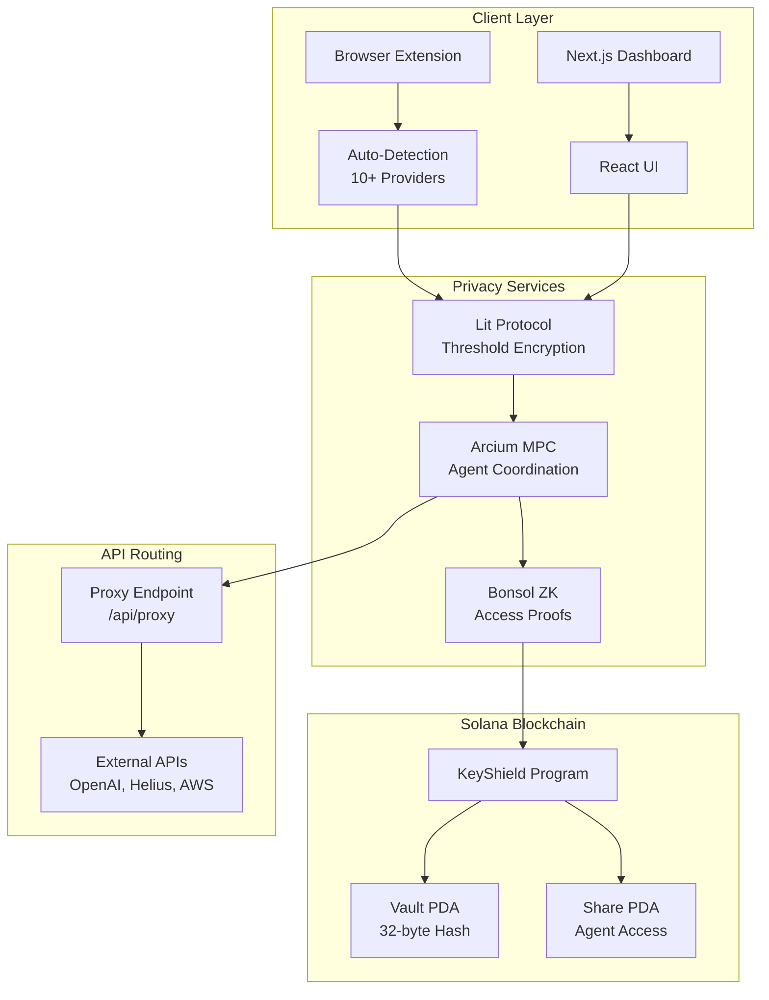

# KeyShield Technical Architecture

**Audience**: Developers, technical evaluators

This document provides a deep dive into KeyShield's architecture: API key vs password detection, Lit Protocol integration, MPC agent coordination, and API routing.

---

## 1. API Key vs Password Detection

### 1.1 Detection Context Differences

| Aspect | Passwords | API Keys |
|--------|-----------|----------|
| **Location** | Form fields (`input[type="password"]`) | Headers, clipboard, .env, code, OCR |
| **Pattern** | Domain-matched (login.example.com) | Provider-specific (`ghp_`, `AIza`, `sk-`) |
| **Risk** | Account lockout | Financial/data leak |
| **Auto-Fill** | Safe (wrong password = fail login) | Dangerous (wrong fill = key exposure) |

### 1.2 KeyShield Detection Flow

Detection happens in the browser extension (content script and background service worker):

1. **Form field scanning** — Bitwarden-style: scan inputs for API key patterns and field names.
2. **Clipboard monitoring** — On paste, check text against provider-specific regex.
3. **HTTP header interception** (future) — Service worker intercepts outgoing requests; detect keys in `X-API-Key`, `Authorization`.
4. **OCR** (planned) — Screenshot/screen content for keys in images.

### 1.3 Detection Patterns

- **GitHub**: `/^gh[porus]_[A-Za-z0-9]{36}$/`
- **OpenAI**: `/^sk-[A-Za-z0-9]{48}$/`
- **Google Gemini**: `/^AIza[A-Za-z0-9_-]{35}$/`
- **Helius/Solana RPC**: `/^[a-f0-9]{32,64}$/` + domain check
- **bloXroute**: `/^[A-Za-z0-9]{40,}$/` + authorization.bloxroute.com

See [API_DETECTION_GUIDE.md](API_DETECTION_GUIDE.md) for implementation details and code examples.

---

## 2. Lit Protocol Integration

### 2.1 Why Lit Protocol (vs Local Encryption)

- **Threshold crypto**: Decrypt only if N/M nodes agree conditions are met (no single point of failure).
- **Conditions**: Wallet address, time-lock, NFT/token ownership, on-chain state.
- **Use case**: API key accessible only by owner wallet and after a 48hr time-lock.

### 2.2 On-Chain vs Off-Chain Storage

- **On-chain**: 32-byte `dataToEncryptHash` in the Vault account (`encrypted_key_hash: [u8; 32]`).
- **Off-chain**: Full Lit ciphertext (1–5 KB) in IndexedDB keyed by hash.
- **Benefit**: ~96% storage reduction on-chain; cost-efficient.

### 2.3 Data Flow

1. **Encrypt**: Frontend calls Lit SDK with API key + access conditions → `ciphertext` + `dataToEncryptHash`.
2. **Store**: Ciphertext → IndexedDB; hash → Solana vault account.
3. **Decrypt**: Read hash from vault → fetch ciphertext from IndexedDB → Lit decrypt with session signatures (wallet proof).

See [LIT_INTEGRATION_GUIDE.md](LIT_INTEGRATION_GUIDE.md) for conditional decryption and code examples.

---

## 3. MPC Agent Coordination (Arcium)

### 3.1 Use Case

Agent1 detects a key; Agent2 needs it for an API call. Neither should hold plaintext. MPC coordinates decryption and use without full reveal.

### 3.2 Flow

1. Agent1 encrypts key with Lit and stores hash on-chain.
2. Agent2 requests access to vault (on-chain).
3. Arcium MPC: Agent1 provides encrypted share; Agent2 provides proof.
4. MPC computes decryption; API key is used inside MPC (e.g., for API call); result is encrypted for Agent1.
5. Agent2 never sees the raw API key.

### 3.3 Why MPC for Agents

- **No full reveal**: Agent2 never sees plaintext.
- **Coordination**: Multiple agents can use the same key without duplication.
- **Audit trail**: MPC computations can be logged on Arcium network.

See [MPC_COORDINATION_GUIDE.md](MPC_COORDINATION_GUIDE.md) for agent-to-agent workflows and integration patterns.

---

## 4. API Routing Bridge

### 4.1 Problem

APIs (OpenAI, Helius) require keys in headers. Agents should not store keys; they need a way to make confidential calls.

### 4.2 Solution

A proxy endpoint (e.g. `/api/proxy`) that:

1. Accepts encrypted intent + vault hash + wallet signature.
2. Verifies wallet signature.
3. Decrypts API key from vault (Lit conditional decrypt).
4. Routes the request to the target API with the decrypted key.
5. Encrypts the response for the agent.

### 4.3 Benefits

- **Reusable**: Single endpoint for all agent-to-API calls.
- **Confidential**: Keys never leave the proxy as plaintext in responses.
- **Auditable**: Optional on-chain logging of proxy calls.

See [API_ROUTING_GUIDE.md](API_ROUTING_GUIDE.md) for implementation and code.

---

## 5. System Overview

---

## 6. Key Files in the Repo

| Component | Location |
|-----------|----------|
| Solana program | `programs/keyshield/` |
| Vault state | `programs/keyshield/src/state.rs` |
| Frontend + extension | `frontend/` |
| Vault list + metadata | `frontend/hooks/useVaults.ts` |
| Solana + metadata APIs | `frontend/lib/solana.ts` |
| Extension content script | `frontend/content.js` |
| Extension background | `frontend/background.js` |

---

## 7. Related Documentation

- [TECHNICAL_ARCHITECTURE_HUMANIZED.md](TECHNICAL_ARCHITECTURE_HUMANIZED.md) — Same content in plain English, easier to read.
- [API_DETECTION_GUIDE.md](API_DETECTION_GUIDE.md) — Detection vs password managers, patterns, code.
- [LIT_INTEGRATION_GUIDE.md](LIT_INTEGRATION_GUIDE.md) — Lit Protocol setup and conditional decrypt.
- [MPC_COORDINATION_GUIDE.md](MPC_COORDINATION_GUIDE.md) — Arcium MPC flows.
- [API_ROUTING_GUIDE.md](API_ROUTING_GUIDE.md) — Proxy implementation.
- [ARCHITECTURE.md](../../ARCHITECTURE.md) — Full project architecture.
