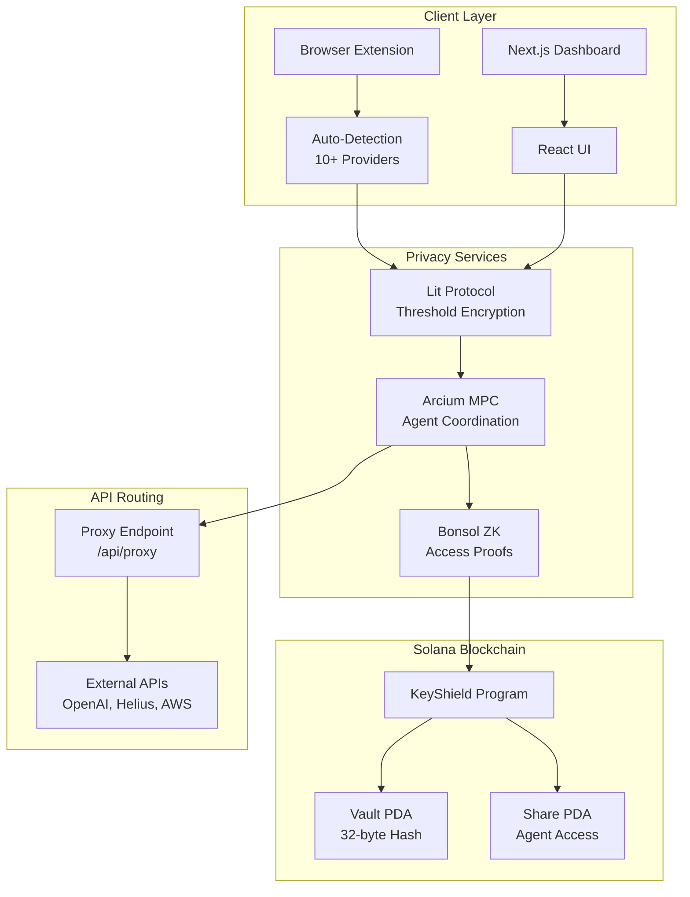

# KeyShield Technical Architecture — In Plain English

**Audience**: Developers, technical evaluators, anyone who wants to understand how KeyShield works without drowning in jargon.

This doc walks through the main pieces: how we get your wallet, where we store metadata, how Lit and Light fit in, how we detect API keys (and why that's different from passwords), and how agents might use keys without ever seeing them.

---

## 1. Clerk Solana Wallet Bridge

**How we know which wallet to use**

When you sign in with Solana (Phantom, etc.), Clerk can link that wallet to your account. In the Clerk Dashboard, you turn this on under User & Auth → Web3 → Enable Solana. Once it’s enabled, the signed-in user has `user.web3Wallets[0].web3WalletAddress` — that’s your Solana pubkey, and Clerk keeps it linked to your user record.

If you’re not using SIWS, we fall back to `localStorage.getItem('keyshield_wallet_address')`. That way, a wallet can be set elsewhere (e.g. the extension) and the app can still pick it up.

The dashboard passes this wallet into `useVaults(searchQuery, activeFilter, userId, walletAddress)`. When `walletAddress` is set, the list is driven by your on-chain vault(s) plus local metadata. When it’s not set, we use the legacy path: Clerk `userId` plus localStorage or chrome.storage only.

---

## 2. Vault Metadata Storage (Local / Extension)

**Where we keep names, domains, and tags — not secrets**

We store display and search metadata under keys like `keyshield_meta_<vaultId>`, where `vaultId` is the vault PDA base58 (or owner, depending on context). The value is a JSON object: `{ name, domain?, type, notes?, tags? }`. This is only for display and search — no secret values.

- **Browser**: We use `localStorage` only.
- **Extension**: We write and read from both `localStorage` and `chrome.storage.local` so the dashboard and extension (popup, background) share the same metadata when running in the extension context.

In `frontend/lib/solana.ts` we have:
- `getVaultMetadata` — sync, reads from localStorage
- `getVaultMetadataAsync` — async, uses chrome.storage when available
- `setVaultMetadata` — writes to both when chrome.storage exists

---

## 3. Lit Protocol (Encryption)

**Why we use Lit instead of “just encrypt it locally”**

The goal is to encrypt API keys so that decryption only works when *your wallet* signs. Local AES can’t enforce that — anyone with the key material can decrypt. Lit provides this via a decentralized threshold network: a set of nodes have to agree that conditions are met before they help you decrypt.

The flow is simple: we call `encryptWithLit(apiKey, walletPubkey)`, get back `{ ciphertext, dataToEncryptHash }`, store the ciphertext in IndexedDB, and put the hash on-chain.

In dev we use the Datil-dev network; in production we use Lit mainnet.

---

## 4. Light Protocol (ZK Compression)

**How we keep on-chain storage cheap**

Storing data on Solana is expensive. Light Protocol uses zero-knowledge compression to store our 32-byte hash on-chain for a fraction of the cost — about 15K lamports per key, roughly 95% cheaper than standard PDAs.

You need Helius RPC with ZK Compression support (`VITE_HELIUS_API_KEY`). If Light isn’t available, we fall back to the KeyShield program vault: up to 8 keys per wallet, still about 80% cheaper than the old one-vault-per-key model.

In the UI, items show either ⚡ COMPRESSED (Light) or 📦 ON-CHAIN (program) so you know which path was used.

---

## 5. API Key vs Password Detection

**Why we treat them differently**

Passwords and API keys live in different places and carry different risks.

| | Passwords | API Keys |
|--|-----------|----------|
| **Where they show up** | Form fields (e.g. `input[type="password"]`) | Headers, clipboard, .env, code, even OCR’d screenshots |
| **How we spot them** | Domain-matched (e.g. login.example.com) | Provider-specific patterns like `ghp_`, `AIza`, `sk-` |
| **What goes wrong if we mess up** | Wrong fill → failed login | Wrong fill → key exposure, spend, data leak |
| **Auto-fill risk** | Safe; wrong password just fails | Dangerous; wrong fill exposes the key |

So we can’t treat API keys like passwords. We need broader detection and stricter handling.

**How KeyShield detects keys**

The browser extension (content script and background worker) handles detection:

1. **Form fields** — Bitwarden-style scanning of inputs for API key patterns and field names.
2. **Clipboard** — On paste, we check the text against provider-specific regex.
3. **HTTP headers** (planned) — Service worker intercepts outgoing requests and looks for keys in `X-API-Key` and `Authorization`.
4. **OCR** (planned) — Detect keys in screenshots or screen content.

**Patterns we look for**

- **GitHub**: `/^gh[porus]_[A-Za-z0-9]{36}$/`
- **OpenAI**: `/^sk-[A-Za-z0-9]{48}$/`
- **Google Gemini**: `/^AIza[A-Za-z0-9_-]{35}$/`
- **Helius/Solana RPC**: `/^[a-f0-9]{32,64}$/` plus domain check
- **bloXroute**: `/^[A-Za-z0-9]{40,}$/` plus authorization.bloxroute.com

See [API_DETECTION_GUIDE.md](API_DETECTION_GUIDE.md) for implementation details and code.

---

## 6. Lit Protocol Integration (Deeper Dive)

**Why Lit instead of local encryption**

- **Threshold crypto**: Decryption only happens if enough Lit nodes agree that conditions are met — no single point of failure.
- **Conditions**: We can gate access on wallet address, time-lock, NFT/token ownership, or on-chain state.
- **Use case**: An API key that’s only decryptable by the owner’s wallet and optionally after a 48-hour time-lock.

**What goes on-chain vs off-chain**

- **On-chain**: We store a 32-byte `dataToEncryptHash` in the Vault account (`encrypted_key_hash`).
- **Off-chain**: The full Lit ciphertext (1–5 KB) lives in IndexedDB, keyed by hash.
- **Benefit**: Roughly 96% storage reduction on-chain — much cheaper.

**The data flow**

1. **Encrypt**: The frontend calls the Lit SDK with the API key and access conditions, and gets back `ciphertext` and `dataToEncryptHash`.
2. **Store**: Ciphertext goes to IndexedDB; hash goes to the Solana vault account.
3. **Decrypt**: We read the hash from the vault, fetch the ciphertext from IndexedDB, then use Lit to decrypt with session signatures (wallet proof).

See [LIT_INTEGRATION_GUIDE.md](LIT_INTEGRATION_GUIDE.md) for conditional decryption and examples.

---

## 7. MPC Agent Coordination (Arcium)

**The problem**

One agent detects a key; another needs it for an API call. Neither should ever hold the plaintext.

**How MPC helps**

1. Agent1 encrypts the key with Lit and stores the hash on-chain.
2. Agent2 requests access to the vault (on-chain).
3. Arcium MPC: Agent1 provides an encrypted share; Agent2 provides a proof.
4. MPC runs the decryption; the API key is used *inside* MPC (e.g. for an API call); the result is encrypted back for Agent1.
5. Agent2 never sees the raw API key.

**Why this matters**

- **No full reveal**: Agent2 never sees plaintext.
- **Coordination**: Multiple agents can use the same key without duplication.
- **Audit trail**: MPC computations can be logged on the Arcium network.

See [MPC_COORDINATION_GUIDE.md](MPC_COORDINATION_GUIDE.md) for agent-to-agent workflows and integration patterns.

---

## 8. API Routing Bridge

**The problem**

APIs like OpenAI and Helius expect keys in headers. Agents shouldn’t store keys; they need a way to make confidential calls.

**The solution**

A proxy endpoint (e.g. `/api/proxy`) that:

1. Accepts encrypted intent, vault hash, and wallet signature.
2. Verifies the wallet signature.
3. Decrypts the API key from the vault (Lit conditional decrypt).
4. Routes the request to the target API with the decrypted key.
5. Encrypts the response for the agent.

**Benefits**

- **Reusable**: One endpoint for all agent-to-API calls.
- **Confidential**: Keys never leave the proxy as plaintext in responses.
- **Auditable**: Optional on-chain logging of proxy calls.

See [API_ROUTING_GUIDE.md](API_ROUTING_GUIDE.md) for implementation and code.

---

## 9. System Overview

---

## 10. Key Files in the Repo

| Component | Location |
|-----------|----------|
| Solana program | `programs/keyshield/` |
| Vault state | `programs/keyshield/src/state.rs` |
| Frontend + extension | `frontend/` |
| Vault list + metadata | `frontend/hooks/useVaults.ts` |
| Solana + metadata APIs | `frontend/lib/solana.ts` |
| Extension content script | `frontend/content.js` |
| Extension background | `frontend/background.js` |

---

## 11. Related Documentation

- [API_DETECTION_GUIDE.md](API_DETECTION_GUIDE.md) — Detection vs password managers, patterns, code.
- [LIT_INTEGRATION_GUIDE.md](LIT_INTEGRATION_GUIDE.md) — Lit Protocol setup and conditional decrypt.
- [MPC_COORDINATION_GUIDE.md](MPC_COORDINATION_GUIDE.md) — Arcium MPC flows.
- [API_ROUTING_GUIDE.md](API_ROUTING_GUIDE.md) — Proxy implementation.
- [ARCHITECTURE.md](../../ARCHITECTURE.md) — Full project architecture.
